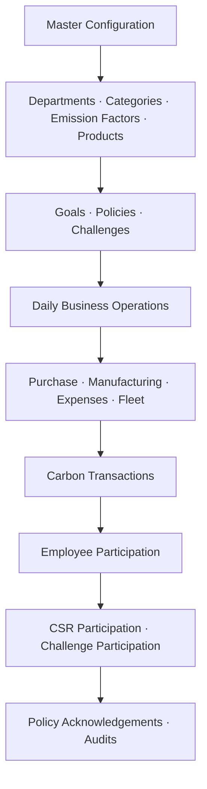

# Ecosphere ESG Platform

Ecosphere ESG Platform helps organizations configure sustainability data, record daily business activity, calculate carbon impact, and track employee participation in ESG and CSR initiatives.

## Required Business Workflow

The platform workflow must follow this order:

### 1. Master Configuration

Set up the organization-wide ESG foundation before operational data is entered.

- Configure departments, product categories, emission factors, and products.
- Define ESG goals, sustainability policies, and employee challenges.
- Keep master data controlled and reviewed so calculations remain consistent.

### 2. Daily Business Operations

Capture business activities that generate carbon impact.

- Record purchase, manufacturing, expense, and fleet activity.
- Map each activity to the correct department, category, product, and emission factor.
- Ensure operational entries are complete before carbon calculations are finalized.

### 3. Carbon Transactions

Convert verified business operations into measurable carbon records.

- Generate carbon transactions from approved operational activity.
- Track emissions by department, category, product, and business source.
- Use the transaction history for dashboards, reporting, and reduction planning.

### 4. Employee Participation

Connect employees to ESG programs after carbon activity is tracked.

- Manage CSR participation and challenge participation.
- Collect policy acknowledgements from employees.
- Run audits to verify data accuracy, policy compliance, and ESG progress.

## Workflow Rule

Master configuration must be completed before daily business operations are recorded. Operations must be converted into carbon transactions before employee participation, acknowledgements, and audits are evaluated.
